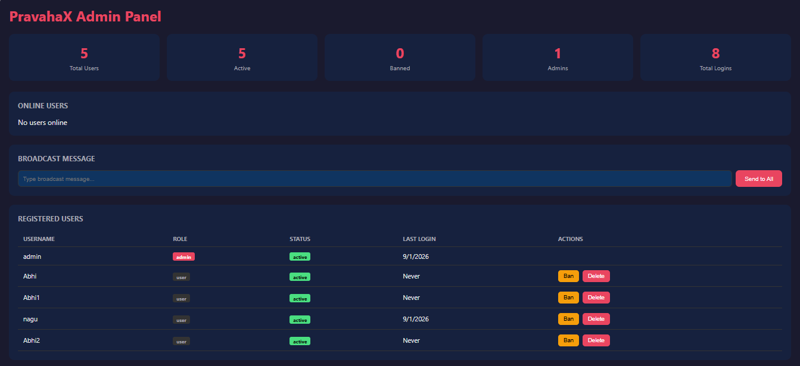

# PravahaX Enterprise

Enterprise-grade local network chat and video call platform.



## Features

### Core
- Real-time text messaging with history (last 200 messages)
- 1-on-1 video and audio calls (WebRTC P2P)
- Group video calls (mesh WebRTC, 3-4 participants)
- Photo/image sharing in chat
- Online user presence
- Works on phone, tablet, computer

### Enterprise
- **Authentication** — JWT-based register/login
- **Roles** — Admin and user permissions
- **Security** — Helmet headers, rate limiting, input sanitization
- **Logging** — Structured logging with Winston (file + console)
- **Monitoring** — Health check endpoint, memory/uptime metrics
- **Admin Panel** — User management, bans, broadcasts, audit logs
- **Audit Trail** — Every action logged with IP and timestamp
- **Graceful Shutdown** — Clean disconnect on SIGTERM/SIGINT
- **Error Recovery** — Auto-reconnect WebSocket, crash handlers
- **Deployment** — Docker, docker-compose, GitHub Actions CI/CD

## Quick Start

```bash
npm install
npm start
```

Or use the batch files (Windows):
- **start.bat** — Start the server
- **kill.bat** — Stop the server

Open `http://localhost:3000`

Default admin: `admin` / `admin123`

## API Endpoints

| Method | Endpoint | Description |
|--------|----------|-------------|
| POST | `/api/auth/register` | Register new user |
| POST | `/api/auth/login` | Login |
| GET | `/api/auth/me` | Get current user |
| PUT | `/api/auth/me/password` | Change password |
| GET | `/api/health` | Health check |
| GET | `/api/online` | Online users |
| GET | `/api/admin/users` | List all users (admin) |
| GET | `/api/admin/stats` | Dashboard stats (admin) |
| GET | `/api/admin/audit` | Audit logs (admin) |
| PUT | `/api/admin/users/:id/role` | Change role (admin) |
| PUT | `/api/admin/users/:id/status` | Ban/unban (admin) |
| DELETE | `/api/admin/users/:id` | Delete user (admin) |
| POST | `/api/admin/kick` | Kick online user (admin) |
| POST | `/api/upload` | Upload image (jpg/png/gif/webp, max 10MB) |

## Admin Panel

Open `http://localhost:3000/admin/`

- View stats dashboard
- Manage users (ban/unban/delete)
- Kick online users
- Send broadcast messages
- View audit logs

## Docker

```bash
docker-compose up -d
```

## Environment Variables

Copy `.env.example` to `.env`:

```bash
cp .env.example .env
```

Key variables:
- `JWT_SECRET` — Secret key for JWT tokens (change in production!)
- `ADMIN_PASSWORD` — Default admin password
- `RATE_LIMIT_MAX` — Max requests per window

## Architecture

```
server.js                 - Entry point
src/
  config/index.js         - Configuration
  middleware/
    auth.js               - JWT authentication & RBAC
    security.js           - Helmet, rate limiting, headers
  models/
    JsonStore.js          - File-based database
    User.js               - User model with bcrypt
    Message.js            - Message persistence (JSON store)
    AuditLog.js           - Audit trail
  routes/
    auth.js               - Register, login, password
    admin.js              - User management, stats
    health.js             - Health check endpoint
    upload.js             - Image upload (multer)
  services/
    websocket.js          - WebSocket with auth, rooms, group calls, admin controls
  utils/
    logger.js             - Winston structured logging
public/
  index.html              - Chat & call UI
  app.js                  - Client-side logic
  admin/index.html        - Admin dashboard
```

## License

MIT
